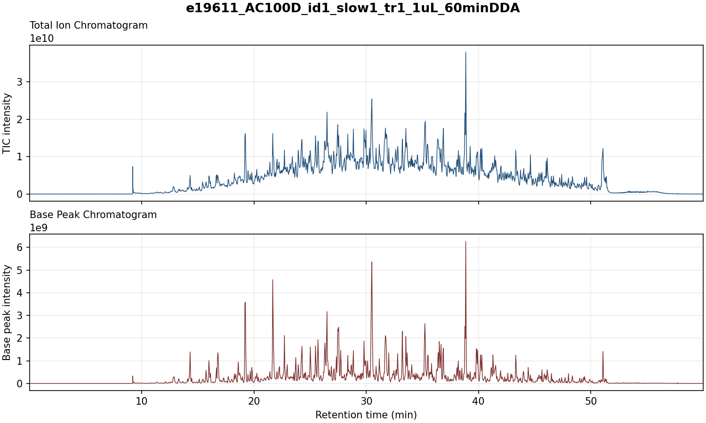

# raw_to_png — Thermo `.RAW` → TIC / base-peak chromatogram PNGs

> **Status:** working prototype, validated against real `.RAW` files. Packaged as an installable CLI with a mocked test suite. Tested on Python 3.14 / Windows with `fisher_py` 2.0.2.

Batch-convert Thermo `.RAW` mass-spectrometry files into chromatogram PNGs. For each `.RAW` in an input directory it writes one PNG with two stacked panels — the **Total Ion Chromatogram** (top) and **Base Peak Chromatogram** (bottom) — titled with the `.RAW` filename stem.



## Background

When inspecting an LC-MS/MS run you usually want a quick look at the TIC and base-peak chromatogram — the same two traces Thermo FreeStyle plots. Doing that through the FreeStyle GUI (or exporting into PowerPoint) is manual and doesn't scale to a folder of runs. This tool reads the `.RAW` files directly via Thermo's RawFileReader (through the [`fisher_py`](https://pypi.org/project/fisher-py/) wrapper) and renders the figures headlessly, one PNG per file.

TIC and base-peak values are read from each scan's **stored scan statistics** (what FreeStyle itself plots), *not* recomputed from centroided peaks — a deliberate choice for fidelity to FreeStyle output. By default only MS1 scans are included.

## Requirements

-   **Windows** (or Linux/macOS with `mono` + .NET configured). `fisher_py` bundles Thermo's RawFileReader .NET assemblies and uses `pythonnet`, so the real reader only runs where .NET is available. This is why CI runs the **mocked** tests on Linux and never invokes the real reader.
-   **Python ≥ 3.9** (verified on 3.14).
-   Dependencies: `fisher_py`, `matplotlib`, `numpy` (installed automatically).

## Install

``` bash
git clone https://github.com/alexis-cmyk/raw_to_png.git
cd raw_to_png
pip install .
```

For development (editable install + test tools):

``` bash
pip install -e ".[dev]"
```

## Usage

After install, a `raw-to-png` console command is available:

``` bash
# Render every .RAW in a folder; default = MS1 only, 200 dpi
raw-to-png --in "C:\path\to\raw_files" --out "C:\path\to\pngs"

# All scans (not just MS1), higher resolution
raw-to-png --in . --out .\out --ms-level 0 --dpi 300

# Also print each labelled peak's base-peak m/z and (best-effort) charge
raw-to-png --in . --out .\out --show-mz --show-charge

# Label the top 5 peaks with m/z only (no intensity text), 2 decimal places
raw-to-png --in . --out .\out --top-peaks 5 --show-mz --hide-intensity --decimals 2
```

| Flag | Default | Meaning |
|----|----|----|
| `--in` | — | Directory containing `.RAW` files (required) |
| `--out` | — | Output directory for PNGs, created if absent (required) |
| `--ms-level` | `1` | MS order to plot (1 = MS1). **`0` = all scans.** |
| `--dpi` | `200` | Output PNG resolution |
| `--top-peaks` | `5` | Mark the N most abundant peaks per panel. **`0` marks none.** (`--peak-labels` is a deprecated alias.) |
| `--label-spacing` | `-0.01` | How close (fraction of RT span) two labels may be before the later one staggers onto a higher row. Negative (the default) keeps every label on the baseline row — the slant separates them; raise it (e.g. `0.05`) to stack crowded labels vertically. |
| `--label-rotation` | `-60` | Angle (degrees, counter-clockwise) the peak labels are slanted. Use `0` for upright labels. |
| `--show-mz` | off | Add each marked scan's **base-peak m/z** to its label (in a slightly smaller font). |
| `--decimals` | `4` | Decimal places shown for m/z values. Only affects `--show-mz`. |
| `--show-charge` | off | Add each marked scan's **base-peak charge** to its label (best-effort). |
| `--hide-intensity` | off | Drop the intensity line from peak labels, leaving only m/z / charge. |

The N most abundant, well-separated peaks in each panel are marked with a dot and labelled, each label slanted (by default −60°) so it rises off its peak and neighbouring labels sit side by side. "Well-separated" means peaks must be at least 1 % of the retention-time span apart, so several scans straddling one apex aren't all labelled as separate peaks. Each panel's maximum is also shown in a large label in the top-left corner. The slant usually keeps crowded labels legible on its own; if labels still collide you can raise `--label-spacing` to stagger them vertically as well, or reduce `--top-peaks`.

Each peak label is built from independently selectable fields. By default it shows the intensity; `--show-mz` and `--show-charge` add the scan's base-peak m/z and charge as extra lines (the m/z line is a couple of points smaller, as secondary detail, and `--decimals` sets its precision), and `--hide-intensity` drops the intensity line so you can label peaks with m/z and/or charge **alone** (e.g. `--top-peaks 5 --show-mz --hide-intensity`). The number of peaks marked is always `--top-peaks` (use `0` to mark none); the show/hide flags only choose what text rides on each. The m/z and charge are those of the scan's **base peak** (its single tallest ion); for the TIC panel — whose value is a sum over all ions with no single m/z — they describe that same scan's base peak. `--show-charge` is **lower-confidence**: charge state is not a stored scan statistic, so it is read from the scan's centroid stream, and Thermo frequently leaves it unassigned for MS1 / profile data. Where no charge is assigned the label reads `z=?`. `--show-charge` also costs one extra read per scan.

The top-left panel-max label ("Max TIC" / "Max base peak") is independent of these flags and always shows the panel's maximum intensity.

The batch is **fail-soft**: a bad `.RAW` is logged and skipped without aborting the rest. A file with no scans at the requested MS level is skipped with a warning.

You can also call it as a library:

``` python
from raw_to_png import get_chromatograms, render_png

# Per included scan: retention time, TIC, base-peak intensity, base-peak m/z,
# base-peak charge (charge is all-nan unless want_charge=True).
rt, tic, bpc, bpm, charge = get_chromatograms("run.raw", ms_level=1)
render_png("run.raw", "out/", ms_level=1, dpi=200, show_mz=True)
```

## Repository layout

```         
raw_to_png/
├── src/raw_to_png/
│   ├── core.py        # extract_chromatograms (pure), get_chromatograms, render_png
│   └── cli.py         # argparse entry point + .RAW discovery
├── tests/             # pytest suite with a fully mocked reader (runs anywhere)
├── .github/workflows/ # CI: lint + mocked tests on Linux
├── pyproject.toml     # packaging + `raw-to-png` console script
└── README.md
```

Input `.RAW` files and output `.png` files are **gitignored** (size / generated); supply your own `.RAW` files via `--in`.

## Gotchas & notes (for future maintainers)

-   **`ms_order` is a plain `Enum`, not an `IntEnum`.** `int(scan_filter.ms_order)` raises `TypeError`; compare `scan_filter.ms_order.value` instead. MS1 is `MsOrderType.Ms` (value `1`), MS2 is `MsOrderType.Ms2` (value `2`). This was the one real bug found while validating the original prototype.
-   **Base peak comes from stored stats**, matching FreeStyle. If results differ from an expected centroid-based base peak, that's the reason — it's intentional. The base-peak **m/z** (`--show-mz`) likewise comes from `stats.base_peak_mass`.
-   **Charge (`--show-charge`) is best-effort and not a scan statistic.** It is read from `get_centroid_stream(scan, False).charges` (the entry matching the base peak's intensity). Thermo leaves this unassigned for much MS1 / profile data, so the helper returns `nan` (rendered `z=?`) whenever the stream is missing, empty, or carries no positive charge — never assume a populated charge for every scan.
-   **Case-insensitive glob double-listing:** file discovery globs both `*.raw` and `*.RAW` then de-dupes via `set()`, because a case-insensitive filesystem (Windows) would otherwise list each file twice. Keep that de-dupe if refactoring.
-   **`fisher_py` API names** used here (`file_factory`, `select_instrument`, `run_header_ex.first_spectrum/last_spectrum`, `get_filter_for_scan_number`, `get_scan_stats_for_scan_number`, `retention_time_from_scan_number`) are all verified against `fisher_py` 2.0.2. If a future version drifts, inspect the raw object with `dir()`.

## Testing

``` bash
pip install -e ".[dev]"
pytest
```

Tests mock the Thermo reader, so the whole suite runs on any platform without `.RAW` files or .NET.

## License

[MIT](LICENSE). Note that Thermo's RawFileReader (bundled by `fisher_py`) is distributed under its own license, free for non-commercial use; the MIT license here covers only this project's code, not the RawFileReader assemblies.
